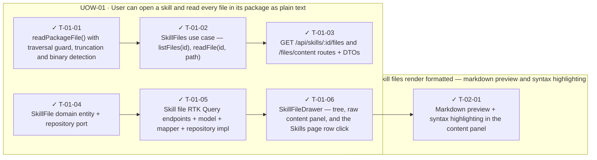

<!-- GENERATED by scripts/uow_graph.py — do not edit by hand -->

# Ticket graph — 2026082902-skill-file-viewer

- Units of Work: **2**
- Tickets: **7** (7 done)
- Total effort: **2.6d**
- Critical path: **1.5d** across 4 tickets
- Theoretical minimum duration with unlimited parallelism: **1.5d**

## Units of Work

| UoW | Title | Risk | Effort | Elapsed | Depends on | Status |
|-----|-------|------|--------|---------|-----------|--------|
| UOW-01 | User can open a skill and read every file in its package as plain text | medium | 2.1d | 1.1d | — | todo |
| UOW-02 | Skill files render formatted — markdown preview and syntax highlighting | low | 4h | 4h | UOW-01 | todo |

Effort is total person-hours. Elapsed is the longest dependency chain inside the
slice — the floor on how fast it can finish no matter how many people work on it.

## Dependency graph

## Execution waves

Tickets in the same wave have no dependency between them and can run in parallel.

| Wave | Tickets | Parallel capacity | Wave duration (longest ticket) |
|------|---------|-------------------|-------------------------------|
| W1 | T-01-01, T-01-04 | 2 | 4h |
| W2 | T-01-02, T-01-05 | 2 | 3h |
| W3 | T-01-03, T-01-06 | 2 | 4h |
| W4 | T-02-01 | 1 | 4h |

## Write-conflict hazards

None: every pair that writes a shared path is ordered by a dependency.

## Critical path

T-01-04 → T-01-05 → T-01-06 → T-02-01

Total: **1.5d**. Shortening the plan means shortening this chain;
adding people to tickets off this path will not make the feature ship sooner.

## Tickets

| ID | UoW | Layer | Type | Est | Depends on | Verifies | Status |
|----|-----|-------|------|-----|-----------|----------|--------|
| T-01-01 | UOW-01 | infrastructure | feature | 4h | — | AC-03, AC-06, AC-07, AC-08 | done |
| T-01-02 | UOW-01 | application | feature | 2h | T-01-01 | — | done |
| T-01-03 | UOW-01 | interface | feature | 3h | T-01-02 | AC-01 | done |
| T-01-04 | UOW-01 | domain | feature | 1h | — | — | done |
| T-01-05 | UOW-01 | infrastructure | feature | 3h | T-01-04 | — | done |
| T-01-06 | UOW-01 | presentation | feature | 4h | T-01-05 | AC-02, AC-06, AC-07, AC-09, AC-10, AC-11 | done |
| T-02-01 | UOW-02 | presentation | feature | 4h | T-01-06 | AC-04, AC-05 | done |
