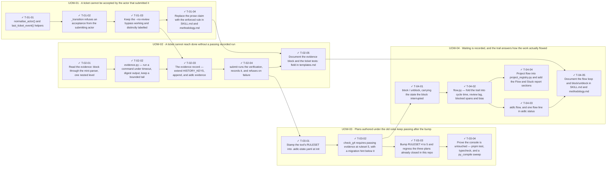

<!-- GENERATED by scripts/uow_graph.py — do not edit by hand -->

# Ticket graph — 2026090601-aidlc-core-gate-hardening

- Units of Work: **4**
- Tickets: **18** (18 done)
- Total effort: **5.8d**
- Critical path: **3.6d** across 10 tickets
- Theoretical minimum duration with unlimited parallelism: **3.6d**

## Units of Work

| UoW | Title | Risk | Effort | Elapsed | Depends on | Status |
|-----|-------|------|--------|---------|-----------|--------|
| UOW-01 | A ticket cannot be accepted by the actor that submitted it | low | 1.0d | 1.0d | — | todo |
| UOW-02 | A ticket cannot reach done without a passing recorded run | high | 1.9d | 1.9d | UOW-01 | todo |
| UOW-03 | Plans authored under the old rules keep passing after the bump | high | 1.1d | 1.1d | UOW-02 | todo |
| UOW-04 | Waiting is recorded, and the trail answers how the work actually flowed | medium | 1.8d | 1.4d | UOW-03 | todo |

Effort is total person-hours. Elapsed is the longest dependency chain inside the
slice — the floor on how fast it can finish no matter how many people work on it.

## Dependency graph

## Execution waves

Tickets in the same wave have no dependency between them and can run in parallel.

| Wave | Tickets | Parallel capacity | Wave duration (longest ticket) |
|------|---------|-------------------|-------------------------------|
| W1 | T-01-01, T-02-01 | 2 | 3h |
| W2 | T-01-02, T-02-02 | 2 | 4h |
| W3 | T-01-03 | 1 | 1h |
| W4 | T-01-04, T-02-03 | 2 | 3h |
| W5 | T-02-04 | 1 | 3h |
| W6 | T-02-05, T-03-01 | 2 | 2h |
| W7 | T-03-02 | 1 | 3h |
| W8 | T-03-03, T-04-01 | 2 | 3h |
| W9 | T-03-04, T-04-02 | 2 | 4h |
| W10 | T-04-03, T-04-04 | 2 | 3h |
| W11 | T-04-05 | 1 | 2h |

## Write-conflict hazards

None: every pair that writes a shared path is ordered by a dependency.

## Critical path

T-02-01 → T-02-02 → T-02-03 → T-02-04 → T-03-01 → T-03-02 → T-04-01 → T-04-02 → T-04-03 → T-04-05

Total: **3.6d**. Shortening the plan means shortening this chain;
adding people to tickets off this path will not make the feature ship sooner.

## Tickets

| ID | UoW | Layer | Type | Est | Depends on | Verifies | Status |
|----|-----|-------|------|-----|-----------|----------|--------|
| T-01-01 | UOW-01 | domain | feature | 2h | — | AC-04 | done |
| T-01-02 | UOW-01 | application | feature | 3h | T-01-01 | AC-01, AC-02 | done |
| T-01-03 | UOW-01 | application | test | 1h | T-01-02 | AC-03 | done |
| T-01-04 | UOW-01 | interface | chore | 2h | T-01-03 | AC-02 | done |
| T-02-01 | UOW-02 | domain | feature | 3h | — | AC-07 | done |
| T-02-02 | UOW-02 | infrastructure | feature | 4h | T-02-01 | AC-09, AC-10 | done |
| T-02-03 | UOW-02 | application | feature | 3h | T-02-02, T-01-03 | AC-05 | done |
| T-02-04 | UOW-02 | application | feature | 3h | T-02-03 | AC-06, AC-07 | done |
| T-02-05 | UOW-02 | interface | chore | 2h | T-02-04, T-01-04 | AC-05 | done |
| T-03-01 | UOW-03 | application | feature | 2h | T-02-04 | AC-12 | done |
| T-03-02 | UOW-03 | domain | feature | 3h | T-03-01 | AC-08, AC-11 | done |
| T-03-03 | UOW-03 | test | chore | 2h | T-03-02 | AC-13 | done |
| T-03-04 | UOW-03 | test | test | 2h | T-03-03 | AC-13 | done |
| T-04-01 | UOW-04 | application | feature | 3h | T-03-02 | AC-14, AC-15 | done |
| T-04-02 | UOW-04 | domain | feature | 4h | T-04-01 | AC-16 | done |
| T-04-03 | UOW-04 | interface | feature | 2h | T-04-02 | AC-16, AC-17 | done |
| T-04-04 | UOW-04 | infrastructure | feature | 3h | T-04-02 | AC-17 | done |
| T-04-05 | UOW-04 | interface | chore | 2h | T-04-03, T-02-05 | AC-15 | done |
